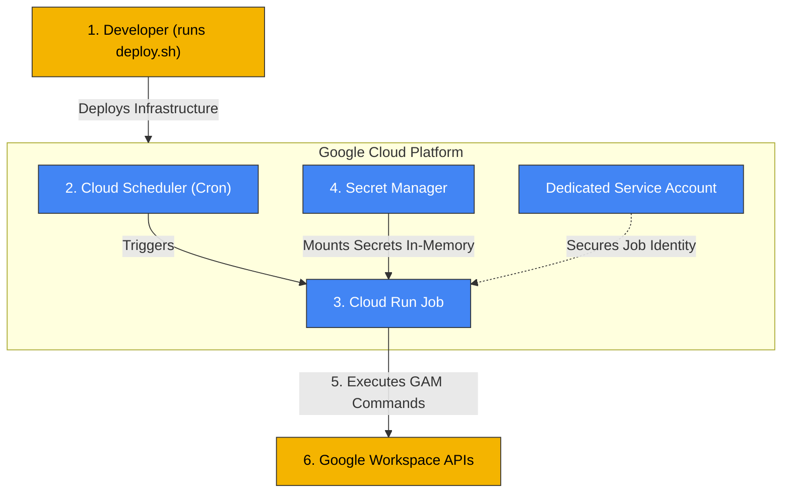

# GAM Automation via Cloud Run Jobs

> [!IMPORTANT]
> **IMPORTANT DISCLAIMER:** This solution offers a recommended approach that is not exhaustive and is not intended as a final enterprise-ready solution. Customers should consult their Dev, security, and networking teams before deployment.

This guide provides step-by-step instructions for taking an existing, manually run GAM (Google Apps Manager) command and automating it securely using Google Cloud Run Jobs and Cloud Scheduler.

---

## The High-Level Concept (In Plain English)
Think of this automation as a secure digital worker that performs your daily Google Workspace tasks automatically:
1. **Wakes up** on a schedule (controlled by **Cloud Scheduler**, which acts like a recurring alarm clock).
2. **Steps into a temporary workspace** (a **Cloud Run Job** container) that exists only for the duration of the task.
3. **Retrieves keys securely from a vault** (**Secret Manager**) to authenticate, performs the work, and immediately discards the keys.
4. **Executes the command** (your customized GAM command in [run.sh]).
5. **Shuts down completely**, ensuring no persistent resources are left running and no credentials remain exposed.

---

## Architecture Diagram



---

## How the Deployment Script ([deploy.sh](deploy.sh)) Works
The provided [deploy.sh](deploy.sh) script fully automates the creation of this secure architecture in Google Cloud:

1. **Enables APIs:** Turns on all required Google Cloud APIs (Cloud Run, Cloud Build, Secret Manager, Cloud Scheduler, Artifact Registry).
2. **Creates Secrets:** Uploads your local GAM credential files into Google Cloud Secret Manager so they are never stored in plain text or baked into the container.
3. **Provisions IAM Permissions:** Creates a dedicated Service Account (`gam-runner-sa`) and grants it the necessary IAM roles (`secretAccessor`, logging, build/run permissions) to adhere to the Principle of Least Privilege.
4. **Builds the Container:** Uses Cloud Build to package the GAM installation into a Docker image and pushes it to Artifact Registry.
5. **Deploys Cloud Run:** Creates or updates a Cloud Run Job, configuring it to securely mount the Secret Manager credentials into the container's memory at runtime.
6. **Schedules the Job:** Creates a Cloud Scheduler HTTP trigger to automatically wake up the Cloud Run Job at a recurring schedule (e.g., every morning).

---

## Customization Guide (What You Should Edit)

Before deploying, customize these files to fit your specific use case:

### 1. Customize Your GAM Command ([run.sh](run.sh))
Open [run.sh](run.sh) and locate the line:
```bash
gam info domain
```
Replace this with the exact command your team runs manually (e.g., `gam print users > users.csv`, or your license assignment scripts).

### 2. Configure the Execution Timeout ([deploy.sh](deploy.sh))
To protect against infinite loops consuming your cloud budget, the Cloud Run Job is configured with a strict execution time limit.
- Open [deploy.sh](deploy.sh).
- Locate the `--task-timeout 10m` parameter in the Cloud Run deployment command.
- If your GAM script takes longer than 10 minutes to run, increase this limit (e.g., `30m` or `1h`).

---

## Prerequisites
- A Google Cloud Project with Billing enabled.
- Google Cloud CLI (`gcloud`) installed and authenticated on your local machine.
- Your existing working GAM credentials (usually stored in `~/.gam` on the machine where GAM is currently installed).
- The following GCP IAM roles assigned to your user account to run the deployment:
  * **Cloud Run Admin**
  * **Cloud Build Editor**
  * **Cloud Scheduler Admin**
  * **Secret Manager Admin**
  * **Service Account Admin** (to create the dedicated SA)

---

## Step-by-Step Setup Guide

### Step 1: Initialize Your Google Cloud CLI
If running from your local machine, open your terminal and authenticate with GCP:
```bash
gcloud auth login
gcloud auth application-default login
```

### Step 2: Extract Existing GAM Credentials
We will use your existing GAM authorization credentials instead of creating new ones. Locate up to three files in your local GAM folder (usually located at `~/.gam` on macOS/Linux or `%USERPROFILE%\.gam` on Windows):
1. `client_secrets.json` (Required: API project credentials)
2. `oauth2.txt` (Optional: Client authorization tokens)
3. `oauth2service.json` (Optional: Service Account authorization tokens)

**Action:** Copy these files into the same directory as this guide. They will **not** be baked into the Docker image; the deployment script uploads them directly to GCP Secret Manager.

> [!TIP]
> **Locating files in Google Cloud Shell:**
> If you run GAM in Google Cloud Shell, you can download files by opening Cloud Shell, clicking the **three dots menu** (top-right of the terminal), choosing **Download File**, and entering the absolute file path (e.g., `/home/<your-username>/.gam/client_secrets.json`).

### Step 3: Run the Deployment Automation
1. Open your terminal in this directory.
2. Make the deployment script executable:
   ```bash
   chmod +x deploy.sh
   ```
3. Run the script:
   ```bash
   ./deploy.sh
   ```
4. Follow the interactive prompts:
   - **GCP Project ID**: The ID of your Google Cloud project.
   - **GCP Region**: Press Enter to default to `us-central1` or type another region.
   - **Artifact Registry Repo Name**: Press Enter to default to `gam-automation-repo`.
   - **Cloud Run Job Name**: Press Enter to default to `gam-daily-job`.
   - **Scheduling**: Type `y` if you want to configure automatic scheduling, then enter a standard Cron expression (e.g., `0 8 * * *` for 8:00 AM daily) and a name for the scheduler job.

---

## How to Test and Verify

Once deployment is complete, you can manually trigger and test your job to verify it functions as expected.

### 1. Execute the Job Manually via CLI
Run the following command (replacing details if you customized names/regions):
```bash
gcloud run jobs execute gam-daily-job --region us-central1
```

### 2. View Execution Logs
You can monitor the output and logs of your execution directly in the Google Cloud Console:
1. Open the [Google Cloud Console](https://console.cloud.google.com/).
2. Navigate to **Cloud Run** -> **Jobs**.
3. Click on your job name (`gam-daily-job`).
4. Click on the **History** tab and select the latest execution to view its output log (which will display the outputs of `gam version`, your command, and debug messages).

---

## Security & Architecture Details
- **Secret Manager Mounting:** Credentials are never packaged inside the container image. They are stored inside Google Cloud Secret Manager and mounted as a temporary volume at runtime.
- **In-Memory Execution:** The mounted volume is ephemeral and exists entirely in-memory (`tmpfs`). When the job completes, this memory is instantly freed, leaving no footprint.
- **Dedicated Service Account:** The job runs under the identity of `gam-runner-sa` rather than the default compute service account. This dedicated service account has only the permissions required to write logs, download secrets, and execute the run job.

---

## Cost & Free Tier Analysis

> [!TIP]
> **IMPORTANT COST DISCLAIMER:** While this automation is designed to fit entirely within Google Cloud's free tier, you should always oversee your billing dashboard and consult with your Cloud FinOps or Dev team to monitor usage.

Google Cloud Run Jobs features a generous perpetual free tier that includes **180,000 vCPU-seconds** and **360,000 GB-seconds** per month.

Since this architecture defaults to 1 vCPU and 512MB of RAM, the primary bottleneck is the vCPU limit. Mathematically, 180,000 seconds per month allows your job to execute for approximately **6,000 seconds (1 hour and 40 minutes) every single day** without incurring any compute charges. As long as your GAM command takes less than 1 hour and 40 minutes to finish daily, your compute cost will be $0.00.
